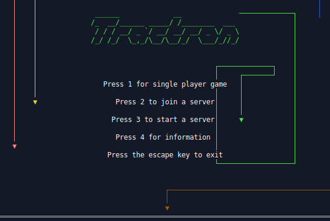

## Summary

Tractron is a TUI Lightcycle game that runs on Linux, Windows, and DOS. It was inspired by GLtron and Armagetron Advanced on Linux. The Linux version runs in a terminal and is a true TUI. The Windows version opens a GUI window and draws text on that using GDI APIs. The DOS version draws text on the screen in 80×25 16 color text mode. The DOS version requires a 32bit CPU.


## Game play

The game is played against AI players in single player mode or against other human players using LAN network multi-player. Players control a lightcycle that leaves a trail behind it as it drives around the game arena. If a player crashes into a lightcycle trail or a wall, the player is eliminated from the arena. The game objective is to last as long as possible without crashing. After all players but one have crashed, players are awarded points based on how long they lasted in the round. After playing 4 rounds, the player with the most points wins the game.


Arrow keys, WASD, and Vim arrow keys can all be used to steer the lightcycle.


At symbols `@` will randomly appear in the game arena. These represent bombs and can be collected by crashing into them. If a player has collected a bomb and then crashes into a lightcycle trail, the bomb will explode eliminating the trails nearby and allow the player to freely pass through them.


When running Tractron as a network server, it opens TCP and UDP port 18000. UDP is used for server discovery. TCP is used for game communication.


## Linux Development Environment Setup

Download the Tractron source code. You can do that by going to the [Tractron Github](https://github.com/MrRar/tractron) and click the code button and then click download zip.

Extract the zip file somewhere.


### Cosmopolitan Setup

Cosmopolitan is used to compile the Windows and Linux version of Tractron.

Download the latest cosmocc release from [Cosmopolitan releases](https://github.com/jart/cosmopolitan/releases).

Extract the zip file to /opt/cosmocc/

Add the toolchain to your path environment variable.

If your shell is Bash you can do that by adding the following line to the .bashrc stored in your home directory.

```
export PATH=$PATH:/opt/cosmocc/bin/
```

Cosmopolitan is now setup. Open a terminal and CD into the folder where you extracted the Tractron source code.

Type `make` and press enter. If all goes well tractron.com should appear in the bin folder.


### DJGPP Setup

DJGPP is used to compile the DOS version of Tractron.

Download the latest release from [build DJGPP releases](https://github.com/andrewwutw/build-djgpp/releases)

Extract the downloaded zip file to /opt/djgpp/

Download the the [csdpmi7b.zip](http://www.delorie.com/pub/djgpp/current/v2misc/csdpmi7b.zip) zip file.

Extract the file named CWSDSTUB.EXE into /opt/djgpp/i586-pc-msdosdjgpp/bin/

This is a DPMI server which is needed when running Tractron in an environment with no existing DPMI server.

You need to setup some environment variables.

If your shell is Bash you can do that by adding the following lines to the .bashrc stored in your home directory.

```
export PATH=$PATH:/opt/djgpp/bin/
export EXE2COFF_PATH=/opt/djgpp/i586-pc-msdosdjgpp/bin/exe2coff
export CWSDSTUB_PATH=/opt/djgpp/i586-pc-msdosdjgpp/bin/CWSDSTUB.EXE
```
DJGPP is now setup. Open a terminal and CD into the folder where you extracted the Tractron source code.

Type `make dos` and press enter. If all goes well tractron.exe should appear in the bin folder.


## License

Code is under the MIT license. Tractron was created by Johannes Fritz.

[Logo font source](http://patorjk.com/software/taag/#p=display&f=Small%20Slant&t=Tractron)
